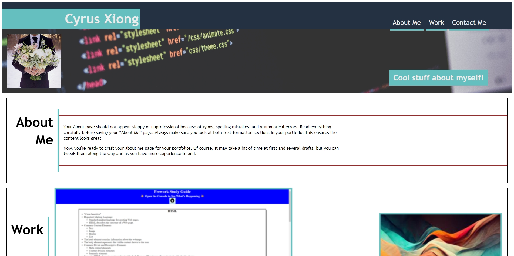

# Current-Portfolio

## Description

This project helps to understand the functionality of both HTML and CSS.

My motivation for creating this was to present projects I've created as well as have a place to store future projects. It also gives me an example of where I'm currently at in reference to learning HTML and CSS.

Building this project, showed me how to change my mindset and allowed me to search for solutions to problems I've run into.

    ```md
    
    ```

    https://github.com/Cyrus212/Current-Portfolio

    https://cyrus212.github.io/Current-Portfolio/